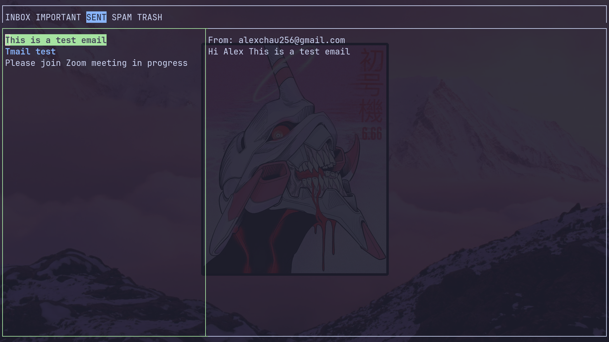

# TMail - Terminal Gmail Client

TMail is a lightweight, terminal-based Gmail client written in Go. It provides a simple and efficient way to access your Gmail account, read emails, send emails, and manage your inbox, all from the command line.

|                        |                        |
| ---------------------- | ---------------------- |
|  |  |

## Features

- **Read Emails:** View your Gmail inbox and read emails without leaving the terminal.
- **Compose Emails:** Compose and send emails directly from the command line.
- **Search:** Search for emails by keyword, sender, date, and more.
- **Attachments:** Download and view email attachments.
- **Labels:** Apply and manage labels to organize your emails.
- **Keyboard Shortcuts:** Navigate and interact with your inbox using keyboard shortcuts.
